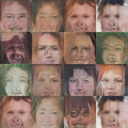
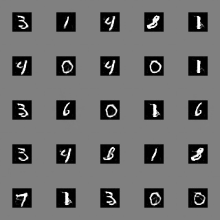

# DCGAN-PyTorch
Implementation of [DCGAN paper](https://arxiv.org/pdf/1511.06434.pdf) with PyTorch.

## DCGAN (Deep Convolutional Generative Adversarial Network)
Generative Adversarial Networks consist of two models: generator and discriminator. 
These two models compete against each other. The generator is trying to learn to 
generate  data that looks like real data. The discriminator is trying to learn 
difference between real and generated data. Input to the generator net is random 
vector (Gaussian noise).

DCGAN is generative model where generator and discriminator are  convolutional networks. 
The goal of generator is to generate images that looks like real images from dataset.

## Environment
Python packages that are used in this implementation is the following:
```
- PyYAML==5.3.1
- tqdm==4.52.0
- json==3.13.2
- numpy==1.19.2
- opencv-python==4.4.0.44
- tensorboardX==2.1
- torch==1.6.0
- torchvision==0.7.0
```
All packages are installed using conda environment. More details about conda can be found 
[here](https://docs.conda.io/projects/conda/en/latest/user-guide/tasks/manage-environments.html).

## Data
Dataset that is used are [CelebA dataset](https://mmlab.ie.cuhk.edu.hk/projects/CelebA.html) 
and [MNIST dataset](http://yann.lecun.com/exdb/mnist/).
In order to train model data needs to be written in json file as list of paths to images. 
Example is displayed below.
```
[
"/data/000659.jpg",
"/data/149575.jpg",
"/data/200214.jpg"
]
```
Several images from CelebA dataset is displayed on the images below. 


Sample from MNIST dataset is displayed below.


The images are created from 25 images from both datasets.

## Training
To run training run the script ```main.py``` with the argument ```--config``` which is 
yaml file with parameters. Example of the config file is provided in the repo: ```config.yaml```. 
The content of the config file is the following:
```
Data:
  data_path: "./train.json"  # Path to json file with list of images
Generator:
  learning_rate: 0.0002  # Learning rate for generator net
  optimizer: "Adam"  # Optimizer for generator net
  pretrained_weights: ""  # Continue training from saved checkpoint
Discriminator:
  learning_rate: 0.0002  # Learning rate for discriminator net
  optimizer: "Adam"  # Optimizer for discriminator net
  pretrained_weights: ""  # Continue training from saved checkpoint
Training:
  generator_num: 14  # Train generator more frequently than discriminator
  input_dim: 100  # Dimension of the random input vector (noise)
  channels: 3  # Number of channels of the generated image
  image_size: [64, 64]  # Size of the generated image. Input shape to the discriminator network
  batch_size: 128  # Batch size
  epochs: 30  # Number of epochs
  device: 0  # GPU id
Logging:
  train_logs: "./run1"   # Log directory for tensorboard and checkpoints
```

After each epoch model will be saved in the directory ```checkpoints``` which is created 
in the directory specified in ```train_logs``` in the config file. Training process is 
monitored with tensorboard. Directory ```tb_logs``` with logs for tensorboard is created 
in the same directory where are checkpoints.

Generator network is trained more frequently than discriminator net. Parameter 
```generator_num``` means that generator network will be trained ```genertor_num``` 
times more frequently than discriminator net. 

## Generate images
After training it is possible to generate images using trained generator net. In order 
to do that run the script ```test.py``` with the following arguments:
```
--model 
    Path to generator model
--in-channels
    Number of channels of the images. Default: 3
--input-dim 
    Input dimension to generator network. Deafult: 100
--out-dir 
    Path to output directory where images will be saved
--num-images 
    Number of images to generate
--num-merge 
    Merge several generated images into one to make a grid. Default: 9
```
The script will save images in the directory that is provided. Parameter ```--num-merge``` 
is used to make a grid of images.

## Results

Note that all results are obtained with fixed predefined values for hyperparameters. 
Hyperparameter search is not done.
### CelebA dataset
Two images below represents discriminator and generator loss during training.


On the image below is displayed several generated image using generator network after training.



The difference between generated images and images form the original dataset is clear. However, taking into account 
the simplicity of the discriminator and generator models the quality of generated images are expected.

### MNIST dataset
Loss functions for discriminator and generator models are displayed below.


Using generator model after training we can generate images. Image below represents 
25 generated images that are created with trained generator.


